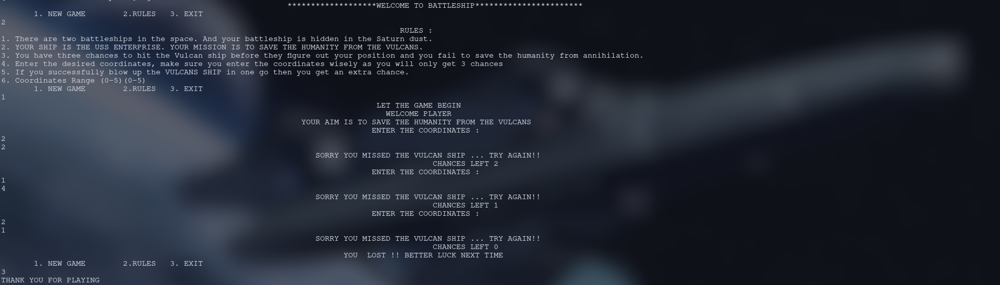

# Backstory ::

**Based on the movie** [Star Trek (2009).](<https://en.wikipedia.org/wiki/Star_Trek_(film)> "Star Trek")

**You can watch the scene around which the game revolves around [here](https://www.youtube.com/watch?v=zlGRNRAL148)**

There are two battleships in the space and your battleship is hidden in the Saturn dust.

Your ship is the **USS ENTERPRISE**. Your mission is to save the humanity from the **VULCANS**.

# Rules ::

- You have three chances to hit the VULCAN ship before the VULCANS figure out your position and you fail to save the humanity.
- Enter the desired coordinates, make sure you enter the coordinates wisely as you will only get 3 chances.
- Coordinates Range (0-5)(0-5).
- You have to press enter after entering the value of x and the same goes for entering the value of y (Here x and y are the coordinates).

This is a CLI game. I am working on a Graphical version.
